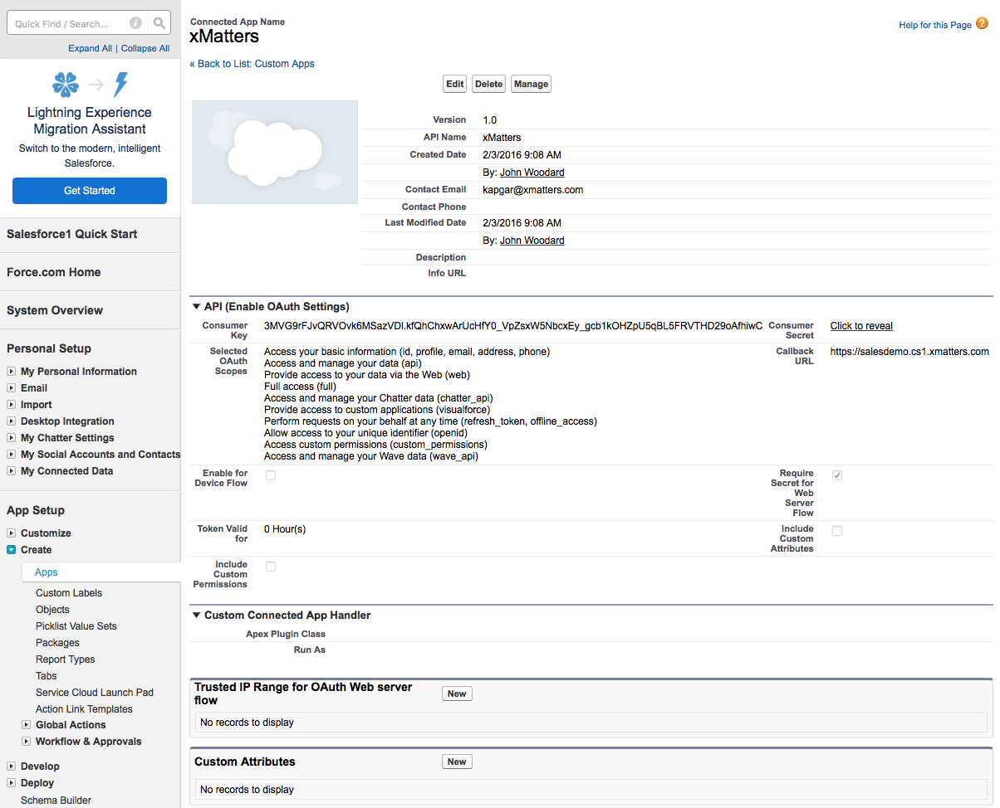
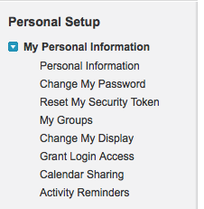
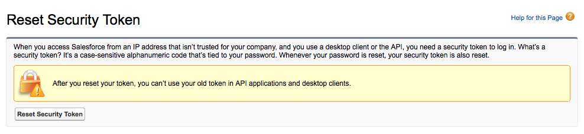
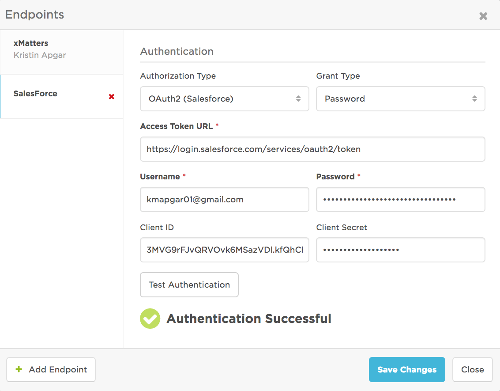
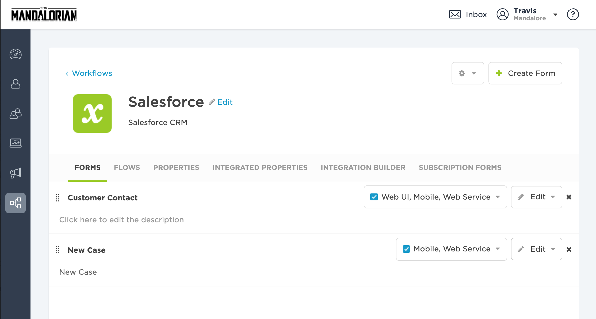
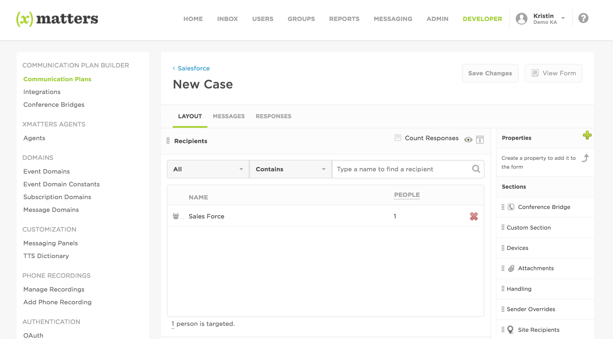

# SalesForce Service
Transform customer relationships, and your business, using the latest in mobile and data technology to deliver the most personalized customer experience ever — every time, and anywhere. This document instructs how to setup an integration between xMatters and SalesForce Case Management.  When a case is created, SalesForce reaches into xMatters to figure out who is on call for assignment of the case.

---------

<kbd>
  
</kbd>

---------


# Pre-Requisites
* SalesForce Case Module
* xMatters account - If you don't have one, [get one](https://www.xmatters.com)!

# Files
* [xMattersAlert.tgr](xMattersAlert.tgr) - The trigger used after a Case is initially submitted.  It sets the tokens/fields of the case that will be passed into xMatters and calls the xMatters request function.
* [xMattersreq.cls](xMattersreq.cls) - This is the Apex class that executes the Restful Post call into xMatters.
* [SalesForce-Outbound-Response_IB.js](SalesForce-Outbound-Response_IB.js) - Updates the Assigned user in the Salesforce Case when an xMatters user selects 'Assign to me' *NOTE: User must be have an active license in both xMatters & Salesforce
* [SalesForce-Inbound_IB.js](SalesForce-Inbound_IB.js) - This recieves the SalesForce payload from the SalesForce Apex Trigger transforms the content (if needed) to be formated for the xMatter New Case Form and creates a new xMatters event. 
* [SalesForce-Outbound-Delivery_IB.js](SalesForce-Outbound-Delivery_IB.js) - Sends a message back into Salesforce with record of recipient and device
* [Salesforce.zip](Salesforce.zip) - The communications plan that contains the integration scripts above.
* [xMattersTest](xMattersTest.txt) - Test APEX Class for Passing Code Coverage in Salesforce
* [xMattersHTTPCalloutMock](xMattersHTTPCalloutMock.txt) - Test APEX Class generates a Mock xMatters Response for xMattersTest.  Test classes cannot make web service calls in Salesforce.

# How it works
When a new SalesForce Case is submitted, SalesForce pushes the information into xMatters.  xMatters kicks off an event and sends the SalesForce case information to the engineer on call.  That engineer has the ability to respond in the xMatters notification.  By accepting the assignment in the xMatters notification, this updates the SalesForce Assignment field.

# Installation

## SalesForce Setup
1. Log into Salesforce as a Salesforce Administrator, Create a new 'Connected App' for OAuth. (Learn more about setting up your Connected App [HERE](https://help.salesforce.com/articleView?id=connected_app_create.htm&type=0)).
* Setup > 'Quick Find / Search..' box (left side of the screen) > Create > Apps .  Once created, note the Consumer Key (Client ID) and Click to reveal Consumer Secret (Client Secret).
<kbd>

</kbd>

2. Log into Salesforce and create a xMatters user.  This user will be used to authenticate to make Restfual API calls for updates to Notes and Assignment field.  Once this user is created set a personal token.  At the top navigation bar go to your name > Setup > Personal Setup > My Personal Information > Reset My Security Token.

<kbd>

</kbd>

<kbd>

</kbd>

3. Using the SFDC Developer Console, Create Apex Trigger to reach out to xMatters. You can use this code to build the message that will be sent to xMatters. Where `XMATTERS_INBOUND_INTEGRATION_URL_HERE` is the inbound integration url. 

```
trigger xMattersAlert on Case (after insert) {
   String endpoint    = 'XMATTERS_INBOUND_INTEGRATION_URL_HERE';
   String caseid      = '"Case ID":' + '"' + Trigger.New[0].CaseNumber + '"';
   string description = '"Description":' + '"' + Trigger.New[0].Description + '"';
   string priority    = '"Priority":' + '"' + Trigger.New[0].Priority + '"';
   string status      = '"Status":' + '"' + Trigger.New[0].Status + '"';
   string accountid   = Trigger.New[0].AccountID;
   string accountidj  = '"Account ID":' + '"' + Trigger.New[0].AccountID + '"';
   string recordid    = '"ID":' + '"' + Trigger.New[0].Id + '"';
   
 if (accountid != null){
  Account record = [Select Name  From Account Where Id = :accountid];
        
   string accountname = '"Account Name":' + '"' + record.Name + '"';
        
   String payload = '{' + recordid + ',' + caseid + ',' + description + ',' + subject + ',' + priority + ',' + accountname + ',' + accountidj + ',' + status + '}';
 		System.debug(accountid);
   		System.Debug(payload);
   		xmattersreq.xRESTCall(endpoint, payload); 
    } else {
          string accountname = '"Account Name":' + '"No Account Found"';
        
       String payload = '{' + recordid + ',' + caseid + ',' + description + ',' + subject + ',' + priority + ',' + accountname + ',' + accountidj + ',' + status + '}';
 		System.debug(accountid);
   		System.Debug(payload);
   		xmattersreq.xRESTCall(endpoint, payload); 
   	 }

```
3. In the Salesforce Developer Console, Create an Apex Class for your xMatters Request

```
global class xMattersreq {
  @future(callout=true)
  WebService static void xRESTCall(String endpoint, String payload){
    HttpRequest req = new HttpRequest();
    req.setEndpoint(endpoint);
    req.setMethod('POST');
    
    req.setBody(payload);
    req.setHeader( 'Content-Type', 'application/json' );
    
    Http http = new Http();
    HTTPResponse res = http.send(req);
    System.debug(' Response: ' + res.getBody());
  }
}
```

// WHEN DEPLOYING INTO A SALESFORCE SANDBOX AND PUSHING TO PRODUCTION VIA CHANGE SET, CODE COVERAGE WILL BE REQUIRED.
// THE FOLLOWING STEPS ARE REQUIRED FOR 100% CODE COVERAGE AND A SUCCESSFUL DEPLOYMENT:

4. In the Salesforce Developer Console, Create a new Test Apex Class to emulate an xMatters Response for Code Coverage Testing

xMattersHTTPCalloutMock

```
@isTest
global class xMattersHttpCalloutMock implements HttpCalloutMock {
    // Implement this interface method
    global HTTPResponse respond(HTTPRequest request) {
        // Create a fake response
        HttpResponse response = new HttpResponse();
        response.setHeader('Content-Type', 'application/json');
        response.setBody('{"requestId": “xMatters_Integration_Builder_Response”}’);
        response.setStatusCode(202);
        return response; 
    }
}
```


5. In the Salesforce Developer Console, Create a new Test Apex Class

xMattersTest

```
@isTest
public class xMattersTest {

    public static testMethod void SubmitCaseNoAccount() {
        Case ca = new Case (Subject='Test xMatters Integration');
            ca.Status = 'New';
        	ca.Origin = 'Phone';
        	ca.Description = 'Hello, This is A Test';
        Test.setMock(HttpCalloutMock.class, new xMattersHttpCallOutmock());
        insert ca;

    }

     public static testMethod void SubmitCaseAccount() {
         
        Account ac = new Account (Name='xMatters Test');
         insert ac;
         
         ID acctID = ac.ID;
         
        Case ca = new Case (Subject='Test xMatters Integration');
            ca.Status = 'New';
        	ca.Origin = 'Phone';
         	ca.AccountID = acctID;
    	    ca.Description = 'Hello, This is A Test';
        Test.setMock(HttpCalloutMock.class, new xMattersHttpCallOutmock());
        insert ca;

    }
}
```

6. Create an Outbound Change Set and deploy to your Target Environment (More info on Salesforce Change Sets: https://developer.salesforce.com/docs/atlas.en-us.dev_lifecycle.meta/dev_lifecycle/creating_outbound_changeset.htm)

7. In the Target Environment, Navigate to Inbound Change Sets.  Validate the Change set. You have the option of testing integration against all classes, or opting to test only against our integration test class. (Option 4, enter xMatterSTest)

More Information on Change Set Validation: https://trailhead.salesforce.com/en/modules/app_deployment/units/app_deployment_changesets

8. Confirm Change set was 'Successful'

## xMatters set up
**Option 1: Import the Communication Plan**

1. Import the [Salesforce.zip](Salesforce.zip) Communication Plan (See in files above).  

**Option 2: Add the integration scripts to an existing Comm Plan**

1. Create a new Inbound Integration and paste in the contents of the [SalesForce-Inbound_IB.js](SalesForce-Inbound_IB.js) file.
2. Create a new Outbound Integration for device deliveries with the following settings:

| Item  | Value |
| ----- | ------|
| Trigger | Device Delivery Updates |
| Form | <Select the appropriate form> |
| Action | Run a script |
| Location | Cloud |
| Name | Update Comment - Delivery |

3. Then paste in the contents of the [SalesForce-Outbound-Delivery_IB.js](SalesForce-Outbound-Delivery_IB.js) script. 

4. Create a new Outbound Integration for responses with the following settings:

| Item  | Value |
| ----- | ------|
| Trigger | Notification Responses |
| Form | `Select the appropriate form` |
| Action | Run a script |
| Location | Cloud |
| Name | Update Assign Field - Response |

5. Then paste in the contents of the [SalesForce-Outbound-Response_IB.js](SalesForce-Outbound-Response_IB.js) script. 

**Complete the setup**

1. In Integration Builder, Configure your Salesforce Endpoint  *NOTE: if you're using a relaxed IP policy, you'll need to add your API token to the end of your Password. For the following information see the SalesForce Setup steps above.
* At the top navigation bar in SalesForce go to your name > Setup > Personal Setup > My Personal Information > Reset My Security Token.
* If your password is mypassword, and your security token is XXXXXXXXXX, then you must enter mypasswordXXXXXXXXXX in the xMatters Endpoint to authenticate correctly.
* Client ID & Client Secret can be found by accessing the connected App in Salesforce.  Setup > 'Quick Find / Search..' box (left side of the screen) > Create > Apps > Find 'Connected Apps' and click on the app (this is the connected app we setup earlier, recommended name is xMatters).  Find Consumer Key (Client ID) and Click to reveal Consumer Secret (Client Secret).

<kbd>

</kbd>

2. Add Recipients/Groups to the xMatters New Case Layout.  Login to xMatters with Developer rights.  Click on the Developer tab.  In the SalesForce Communication Plan navigate to the New Case Form.

<kbd>

</kbd>

* In the New Case Form naviagete to the Layout view and add Recipeients.

<kbd>

</kbd>

   
# Testing
1. The SalesForce Group is the default recipient in the xMatters New Case form.  Add yourself to the xMatters group.  Make sure this same user exists in SalesForce.
2. In SalesForce Create a new case.
3. An event is created automatically in xMatters with the SalesForce case information. The on-call user in the xMatters SalesForce group is notified.  This is all logged back into SalesForce Case Comments.
4. Have the on-call user respond with "Accept the Assignment" in the xMatters notification.
5. This updates SalesForce Assigned to Field and Case Comments.  If you created the case in SalesForce it automatically assigned you the Assignment field you will not notice the update to the Assignment field.  Have a different user create the case then is on-all to test out the functionality.  

# Troubleshooting
Check the SalesForce developer console logging and xMatters Activity streams for the Inbound and Outbound integrations.
