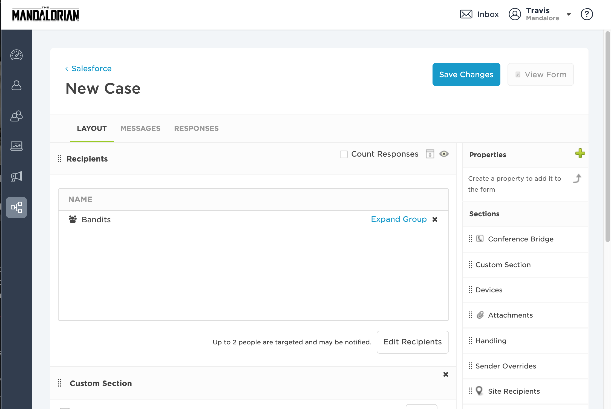

# SalesForce Service
Transform customer relationships, and your business, using the latest in mobile and data technology to deliver the most personalized customer experience ever — every time, and anywhere. This document instructs how to setup an integration between xMatters and SalesForce Case Management.  When a case is created, SalesForce reaches into xMatters to figure out who is on call for assignment of the case.

# Pre-Requisites
* SalesForce Case Module
* xMatters account - If you don't have one, [get one](https://www.xmatters.com)!

# Files
* [xMattersAlert.tgr](xMattersAlert.tgr.js) - The trigger used after a Case is initially submitted.  It sets the tokens/fields of the case that will be passed into xMatters and calls the xMatters request function.
* [xMattersreq.cls](xMattersreq.cls) - This is the Apex class that executes the Restful Post call into xMatters.
* [SalesForce.zip](SalesForce.zip) - The comm plan (if needed) that has all the cool scripts and email format and such. 

# How it works
When a new SalesForce Case is submitted, SalesForce pushes the information into xMatters.  xMatters kicks off an event and sends the SalesForce case information to the engineer on call.  That engineer has the ability to respond in the xMatters notification.  By accepting the assignment in the xMatters notification, this updates the SalesForce Assignment field.

# Installation

## SalesForce Setup
1. Log into Salesforce as a Salesforce Administrator, Create a new 'Connected App' for OAuth. (Learn more about setting up your Connected App [HERE](https://help.salesforce.com/articleView?id=connected_app_create.htm&type=0)).
* Setup > 'Quick Find / Search..' box (left side of the screen) > Create > Apps .  Once created, note the Consumer Key (Client ID) and Click to reveal Consumer Secret (Client Secret).
<kbd>

</kbd>

2. Log into Salesforce and create a xMatters user.  This user will be used to authenticate to make Restfual API calls for updates to Notes and Assignment field.  Once this user is created set a personal token.  At the top navigation bar go to your name > Setup > Personal Setup > My Personal Information > Reset My Security Token.

<kbd>

</kbd>
<kbd>

</kbd>

3. Using the SFDC Developer Console, Create Apex Trigger to reach out to xMatters. You can use this code to build the message that will be sent to xMatters.  *NOTE: String Endpoint will need to be changed to the Integration URL of your Inbound Configuration in the xMatters Integration Builder:

```
trigger xMattersAlert on Case (after insert) {
String endpoint = 'https://[xmatters instance]/api/integration/1/functions/19c22b53-b1e0-46e7-94ed-8c8d0ad704d2/triggers';
String caseid = '"Case ID":' + '"' + Trigger.New[0].CaseNumber + '"';
string description = '"Description":' + '"' + Trigger.New[0].Description + '"';
string priority = '"Priority":' + '"' + Trigger.New[0].Priority + '"';
string status = '"Status":' + '"' + Trigger.New[0].Status + '"';
string accountid = Trigger.New[0].AccountID;
string accountidj = '"Account ID":' + '"' + Trigger.New[0].AccountID + '"';
string recordid = '"ID":' + '"' + Trigger.New[0].Id + '"';

Account record = [Select Name From Account Where Id = :accountid];

string accountname = '"Account Name":' + '"' + record.Name + '"';
String payload = '{' + recordid + ',' + caseid + ',' + description + ',' + priority + ',' + accountname + ',' + accountidj + ',' + status + '}';
System.debug(accountid);
System.Debug(payload);

xmattersreq.xRESTCall(endpoint, payload);

}
```
3. In the Salesforce Developer Console, Create an Apex Class for your xMatters Request

```
global class xMattersreq {
@future(callout=true)
WebService static void xRESTCall(String endpoint, String payload){
HttpRequest req = new HttpRequest();
req.setEndpoint(endpoint);
req.setMethod('POST');

req.setBody(payload);
req.setHeader( 'Content-Type', 'application/json' );

Http http = new Http();
HTTPResponse res = http.send(req);
System.debug(' Response: ' + res.getBody());
}
}
```
 

## xMatters set up
1. Import the Salesforce Communication Plan (See Salesforce.zip in files above).  If you use the attached Salesforce Communication Plan you can skip steps 2-4.

2. Optional - Create an Inbound IB script

3. Optional - Create an Outbound IB Delivery script

4. Optional - Create an Outbound IB Response script

5. In Integration Builder, Configure your Salesforce Endpoint  *NOTE: if you're using a relaxed IP policy, you'll need to add your API token to the end of your Password. For the following information see the SalesForce Setup steps above.
* At the top navigation bar in SalesForce go to your name > Setup > Personal Setup > My Personal Information > Reset My Security Token.
* If your password is mypassword, and your security token is XXXXXXXXXX, then you must enter mypasswordXXXXXXXXXX in the xMatters Endpoint to authenticate correctly.
* Client ID & Client Secret can be found by accessing the connected App in Salesforce.  Setup > 'Quick Find / Search..' box (left side of the screen) > Create > Apps > Find 'Connected Apps' and click on the app (this is the connected app we setup earlier, recommended name is xMatters).  Find Consumer Key (Client ID) and Click to reveal Consumer Secret (Client Secret).

<kbd>

</kbd>

6. Add Recipients/Groups to the xMatters New Case Layout.  Login to xMatters with Developer rights.  Click on the Developer tab.  In the SalesForce Communication Plan navigate to the New Case Form.

<kbd>

</kbd>

* In the New Case Form naviagete to the Layout view and add Recipeients.

<kbd>

</kbd>

   
# Testing
1. The SalesForce Group is the default recipient in the xMatters New Case form.  Add yourself to the xMatters group.  Make sure this same user exists in SalesForce.
2. In SalesForce Create a new case.
3. Automatically, an event is created in xMatters with the SalesForce case  information.  The on call user in the xMatters SalesForce group is notified.  This is all logged back into SalesForce Case Comments.
4. Have the on call user respond with "Accept the Assignment" in the xMatters notification.
5. This updates SalesForce Assigned to Field and Case Comments.  If when you created the case in SalesForce it automatically assigned you the Assignment field you will not notice the update to the Assignment field.  Have a different user create the case then is on call to test out the functionality.  

# Troubleshooting
Check the SalesForce developer console logging and xMatters Activity streams for the Inbound and Outbound integrations.
